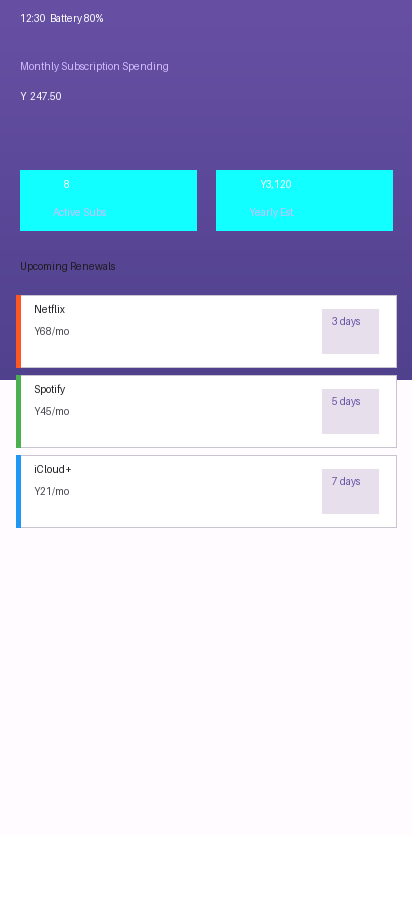
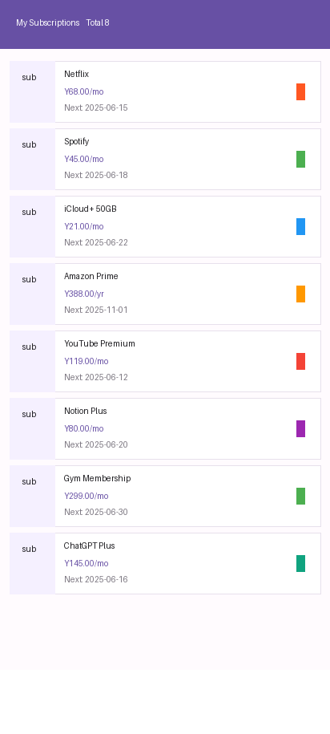
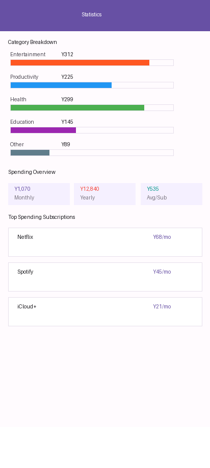
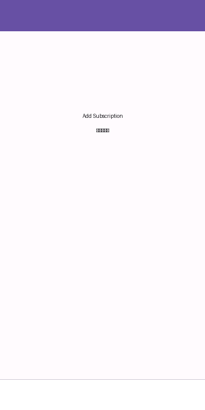
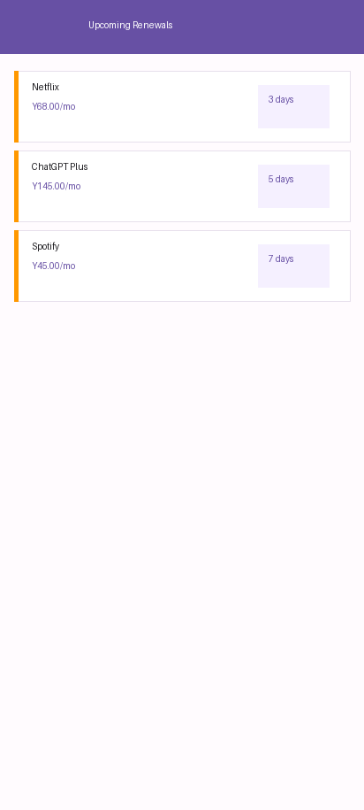
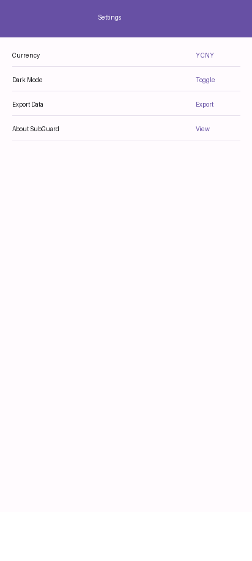

<p align="center">
  
</p>

<h1 align="center">🛡 SubZero</h1>
<p align="center">
  <strong>Privacy-First Subscription Tracker · 隐私优先的订阅管理工具</strong>
</p>

<p align="center">
  
  
  
  
  
</p>

---

## Why SubZero?

市面上大多数订阅管理APP要么收费、要么充满广告、要么要求注册账号收集你的数据。**SubZero 完全开源、完全本地、完全免费。**

- Netflix、Spotify、iCloud、健身房... 每月自动扣费，到底花了多少？
- 什么时候到期续费？会不会忘了取消被白白扣钱？
- 哪些订阅其实用不上，该砍掉了？

SubZero 帮你回答这些问题——**所有数据只存在你的手机上**。

---

## Features / 功能

| 功能 | 说明 |
|---|---|
| 📊 **仪表盘** | 月度/年度总支出、活跃订阅数一目了然 |
| 🔔 **续费提醒** | 到期前自动通知，不再被意外扣费 |
| 📈 **分类统计** | 按影音/工具/健康等7大分类展示占比 |
| 💰 **多币种** | 支持 ¥/$/€/¥ 四种货币 |
| 🔄 **计费周期** | 支持月/年/周/季度四种周期，自动换算月均 |
| 🎨 **Material You** | 紫色主题，Material Design 3 设计 |
| 📤 **数据导出** | JSON格式导出到本地 |
| 🌙 **深色模式** | 内置深色主题切换 |
| 📦 **完全离线** | 无服务器、无账号、无追踪、无广告 |
| 🔓 **MIT 开源** | 代码完全开放，随便用随便改 |

---

## Screenshots

| 仪表盘 | 订阅列表 | 统计分析 |
|:---:|:---:|:---:|
|  |  |  |

| 添加订阅 | 续费提醒 | 设置 |
|:---:|:---:|:---:|
|  |  |  |

---

## Architecture

```
SubZero/
├── app/src/main/java/com/subzero/app/
│   ├── MainActivity.java           # Main dashboard + bottom nav
│   ├── AddSubscriptionActivity.java # Add/edit subscription form
│   ├── SplashActivity.java         # Splash screen
│   ├── model/
│   │   ├── Subscription.java       # Subscription entity
│   │   └── PaymentRecord.java      # Payment history entity
│   ├── db/
│   │   └── StorageManager.java     # SharedPreferences + JSON storage
│   ├── adapter/
│   │   ├── SubscriptionAdapter.java # Subscription list adapter
│   │   └── UpcomingAdapter.java    # Upcoming renewal adapter
│   └── util/
│       ├── NotificationHelper.java # Renewal notification
│       ├── ExportHelper.java       # JSON export
│       ├── RenewalReceiver.java    # Alarm receiver
│       └── BootReceiver.java       # Boot complete receiver
└── app/src/main/res/
    ├── layout/                     # 7 XML layouts
    ├── drawable/                   # Vector icons
    ├── values/                     # Colors, strings, themes
    └── menu/                       # Bottom navigation
```

### Tech Stack

- **Language**: Java 8
- **Min SDK**: Android 7.0 (API 24)
- **Target SDK**: Android 14 (API 34)
- **UI**: Material Design 3 (Material You)
- **Storage**: SharedPreferences + JSON
- **Build**: Gradle 8.5 + AGP 8.2.0

---

## Quick Start

```bash
# Clone
git clone https://github.com/koa-art/SubZero.git
cd SubZero

# Open in Android Studio, sync Gradle, then run
```

Or build from command line:
```bash
./gradlew assembleDebug
# APK: app/build/outputs/apk/debug/app-debug.apk
```

---

## Why No Database?

SubZero, like our sister project [DailyCheckIn](https://github.com/koa-art/DailyCheckIn), uses SharedPreferences + JSON instead of SQLite. For a personal subscription tracker with at most a few hundred records, JSON storage is simpler, faster to develop, and completely sufficient.

---

## Roadmap

- [ ] CSV export
- [ ] Home screen widget
- [ ] Subscription price change history
- [ ] Cloud sync (user opt-in only)
- [ ] Jetpack Compose rewrite

---

## License

MIT License - see [LICENSE](LICENSE)

---

<p align="center">
  <sub>Built with ❤️ · No trackers · No ads · Your data stays yours</sub>
</p>
